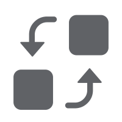

<div style="background-image: linear-gradient(rgba(26, 26, 26, 0.85), rgba(45, 45, 45, 0.85)), url('https://img.picui.cn/free/2025/03/19/67da3b51a5dea.png'); background-size: cover; background-position: center; background-repeat: no-repeat; padding: 40px 20px; border-radius: 15px; margin-bottom: 30px; box-shadow: 0 4px 15px rgba(0,0,0,0.2);">

# <div align="center" style="display: flex; justify-content: center; align-items: center; margin-bottom: 20px;"><span style="font-family: 'Press Start 2P', monospace; background: linear-gradient(45deg, #FF6B6B, #4ECDC4); -webkit-background-clip: text; -webkit-text-fill-color: transparent; text-shadow: 2px 2px 4px rgba(0,0,0,0.2);"> PixelNebula </span></div>

<div align="center" style="margin-bottom: 20px;">
  <p style="color: #ffffff;"><strong>中文</strong> | <a href="README.md" style="color: #4ECDC4;">English</a></p>
</div>

<p align="center" style="margin-bottom: 20px;">
  
</p>

<div align="center" style="margin-bottom: 20px;">
  <p style="color: #ffffff; font-size: 1.2em;">
    <strong>🚀 一个强大、高效且可自定义的 Go 语言 SVG 动态头像生成库</strong>
  </p>
</div>

<div align="center" style="margin-bottom: 20px; padding: 15px; border-radius: 10px;">
  <a href="https://pkg.go.dev/github.com/landaiqing/go-pixelnebula"></a>
  <a href="https://goreportcard.com/"></a>
  <a href="LICENSE"></a>
  <a href="https://github.com/landaiqing/go-pixelnebula/releases"></a>
  <a href="http://makeapullrequest.com"></a>
</div>

<p align="center" style="color: #ffffff;background: rgba(255, 255, 255, 0.1);padding: 15px; border-radius: 10px; ">
  <a href="#-特性" style="color: #4ECDC4;">✨ 特性</a> •
  <a href="#-安装" style="color: #4ECDC4;">📦 安装</a> •
  <a href="#-快速开始" style="color: #4ECDC4;">🚀 快速开始</a> •
  <a href="#-高级用法" style="color: #4ECDC4;">🔧 高级用法</a> •
  <a href="#-动画效果" style="color: #4ECDC4;">💫 动画效果</a> •
  <a href="#-缓存系统" style="color: #4ECDC4;">⚡ 缓存系统</a> •
  <a href="#-基准测试" style="color: #4ECDC4;">📊 基准测试</a> •
  <a href="#-示例和演示" style="color: #4ECDC4;">💡 示例和演示</a> •
  <a href="#-贡献指南" style="color: #4ECDC4;">👥 贡献指南</a> •
  <a href="#-许可证" style="color: #4ECDC4;">📄 许可证</a>
</p>

</div>

<hr/>

## 📋 介绍

<table>
  <tr>
    <td>
      <p><strong style="font-family: 'Press Start 2P', monospace; background: linear-gradient(45deg, #FF6B6B, #4ECDC4); -webkit-background-clip: text; -webkit-text-fill-color: transparent; text-shadow: 2px 2px 4px rgba(0,0,0,0.2);">PixelNebula</strong> 是一个 Go 语言编写的高性能 SVG 头像生成库，专注于创建精美、可定制且高度可动态化的矢量头像。使用 PixelNebula，您可以轻松生成各种风格的头像，添加动画效果，并应用各种主题和样式变化。</p>
      <p>无论是为应用程序创建用户头像、生成唯一标识图标，还是制作动态可视化效果，PixelNebula 都能满足您的需求。</p>
    </td>
    <td width="380">
      <p align="center">
        
        <br/>
        <a href="./assets/example_avatar.svg">示例头像展示</a><br><code><a href="./pixelnebula_test.go">示例代码</a></code>
      </p>
    </td>
  </tr>
</table>

<hr/>

## ✨ 特性

<div>
  <table>
    <tr>
      <td align="center" width="100">
        <br/>
        <strong>多样化风格</strong>
      </td>
      <td align="center" width="100">
        <br/>
        <strong>动画效果</strong>
      </td>
      <td align="center" width="100">
        <br/>
        <strong>可自定义</strong>
      </td>
      <td align="center" width="100">
        <br/>
        <strong>高性能</strong>
      </td>
      <td align="center" width="100">
        <br/>
        <strong>缓存系统</strong>
      </td>
    </tr>
  </table>
</div>

- 🎨 **多样化风格与主题**: 内置多种风格和主题组合，满足不同设计需求
- 🔄 **丰富动画效果**: 支持旋转、渐变、变换、淡入淡出等多种动画
- 🛠️ **完全可自定义**: 自定义风格、主题、颜色和动画效果
- ⚡ **高性能设计**: 优化的代码结构和缓存机制，确保快速生成
- 💾 **智能缓存系统**: 内置缓存系统，提高重复生成效率
- 📊 **缓存监控**: 支持缓存使用情况监控和分析
- 🔍 **链式调用 API**: 简洁明了的 API 设计，支持流畅的链式调用
- 📱 **响应式设计**: 支持自定义尺寸，适应各种显示环境

<hr/>

## 📦 安装

使用 Go 工具链安装包：

```bash
go get github.com/landaiqing/go-pixelnebula
```

<hr/>

## 🚀 快速开始

### 基本用法

以下是生成简单 SVG 头像的基本示例：

<table>
<tr>
<td>

```go
package main

import (
	"fmt"
	"os"

	"github.com/landaiqing/go-pixelnebula"
	"github.com/landaiqing/go-pixelnebula/style"
)

func main() {
	// 创建一个新的 PixelNebula 实例
	pn := pixelnebula.NewPixelNebula()

	// 设置风格和尺寸
	pn.WithStyle(style.GirlStyle)
	pn.WithSize(231, 231)

	// 生成 SVG 并保存到文件
	svg, err := pn.Generate("unique-id-123", false).ToSVG()
	if err != nil {
		fmt.Printf("生成 SVG 失败: %v\n", err)
		return
	}

	// 保存到文件
	err = os.WriteFile("my_avatar.svg", []byte(svg), 0644)
	if err != nil {
		fmt.Printf("保存文件失败: %v\n", err)
		return
	}

	fmt.Println("头像成功生成: my_avatar.svg")
}
```

</td>
<td width="250">
<div align="center">
  
  <p><a href="./assets/example_avatar_1.svg">生成的头像示例</a></p>
</div>
</td>
</tr>
</table>

<hr/>

## 🔧 高级用法

### 自定义主题和风格

<details open>
<summary><strong>点击展开/折叠代码示例</strong></summary>

```go
// 自定义风格
customStyles := []style.StyleSet{
    {
        // 第一种自定义风格
        style.TypeEnv:   `<circle cx="50%" cy="50%" r="48%" fill="#FILL0;"></circle>`,
        style.TypeHead:  `<circle cx="50%" cy="50%" r="35%" fill="#FILL0;"></circle>`,
        style.TypeClo:   `<rect x="25%" y="65%" width="50%" height="30%" fill="#FILL0;"></rect>`,
        style.TypeEyes:  `<circle cx="40%" cy="45%" r="5%" fill="#FILL0;"></circle><circle cx="60%" cy="45%" r="5%" fill="#FILL1;"></circle>`,
        style.TypeMouth: `<path d="M 40% 60% Q 50% 70% 60% 60%" stroke="#FILL0;" stroke-width="2" fill="none"></path>`,
        style.TypeTop:   `<path d="M 30% 30% L 50% 10% L 70% 30%" stroke="#FILL0;" stroke-width="4" fill="#FILL1;"></path>`,
    },
}

// 应用自定义风格
pn2.WithCustomizeStyle(customStyles)
// 自定义主题
customThemes := []theme.Theme{
{
    theme.ThemePart{
        // 环境部分颜色
        "env": []string{"#FF5733", "#C70039"},
        // 头部颜色
        "head": []string{"#FFC300", "#FF5733"},
        // 衣服颜色
        "clo": []string{"#2E86C1", "#1A5276"},
        // 眼睛颜色
        "eyes": []string{"#000000", "#FFFFFF"},
        // 嘴巴颜色
        "mouth": []string{"#E74C3C"},
        // 头顶装饰颜色
        "top": []string{"#884EA0", "#7D3C98"},
        },
    },
}

pn.WithCustomizeTheme(customTheme)

```

</details>

### 使用 SVGBuilder 链式调用

<details open>
<summary><strong>点击展开/折叠代码示例</strong></summary>

```go
pn := NewPixelNebula().WithDefaultCache()
pn.Generate("my-avatar", false).
    SetStyle(style.GirlStyle).
    SetTheme(0).
    SetSize(231, 231).
    SetRotateAnimation("env", 0, 360, 10, -1).
    SetGradientAnimation("env", []string{"#3498db", "#2ecc71", "#f1c40f", "#e74c3c", "#9b59b6"}, 8, -1, true).
    Build().
    ToSVG()
```

</details>

<hr/>

## 💫 动画效果

PixelNebula 支持多种动画效果，可以让您的头像栩栩如生：

<div>
  <table>
    <tr>
      <td align="center" width="150">
        <br/>
        <a href="./assets/example_avatar_2.svg">旋转动画</a>
      </td>
      <td align="center" width="150">
        <br/>
        <a href="./assets/example_avatar_3.svg">渐变动画</a>
      </td>
      <td align="center" width="150">
        <br/>
        <a href="./assets/example_avatar_4.svg">淡入淡出</a>
      </td>
      <td align="center" width="150">
        <br/>
        <a href="./assets/example_avatar_5.svg">路径动画</a>
      </td>
      <td align="center" width="150">
        <h1>...</h1>
      </td>
    </tr>
  </table>
</div>

<details>
<summary><strong>点击查看动画代码示例</strong></summary>

```go
pn := NewPixelNebula()

// 设置风格
pn.WithStyle(style.AfrohairStyle)
pn.WithTheme(0)

// 1. 旋转动画 - 让环境和头部旋转
pn.WithRotateAnimation("env", 0, 360, 10, -1) // 无限循环旋转环境

// 2. 渐变动画  - 让环境渐变
pn.WithGradientAnimation("env", []string{"#3498db", "#2ecc71", "#f1c40f", "#e74c3c", "#9b59b6"}, 8, -1, true)
// 2. 渐变动画  - 让眼睛渐变
pn.WithGradientAnimation("eyes", []string{"#3498db", "#2ecc71", "#f1c40f", "#e74c3c", "#9b59b6"}, 8, -1, true)

// 3. 淡入淡出动画 - 让眼睛闪烁
pn.WithFadeAnimation("eyes", "1", "0.3", 2, -1)

// 4. 变换动画 - 让嘴巴缩放
//pn.WithTransformAnimation("mouth", "scale", "1 1", "1.2 1.2", 1, -1)

// 5. 颜色变换动画 - 让头发颜色变换
pn.WithColorAnimation("top", "fill", "#9b59b6", "#e74c3c", 3, -1)
// 5. 颜色变换动画 - 让衣服颜色变换
pn.WithColorAnimation("clo", "fill", "#9b59b6", "#e74c3c", 3, -1)

// 6. 弹跳动画 - 让嘴巴弹跳
pn.WithBounceAnimation("mouth", "transform", "0,0", "0,-10", 5, 2.5, -1)
// 6. 旋转动画 - 让嘴巴旋转
pn.WithRotateAnimation("mouth", 0, 360, 10, -1) // 无限循环旋转环境

//// 7. 波浪动画 - 让衣服产生波浪效果
//pn.WithWaveAnimation("clo", 5, 0.2, "horizontal", 4, -1)

// 8. 闪烁动画 - 让头顶装饰闪烁
//pn.WithBlinkAnimation("head", 0.3, 1.0, 4, 6, -1)
// 8. 波浪动画 - 让环境产生波浪效果
//pn.WithWaveAnimation("clo", 5, 2, "horizontal", 4, -1)

// 9. 路径动画 - 让眼睛沿着路径移动
//pn.WithPathAnimation("eyes", "M 0,0 C 10,-10 -10,-10 0,0", 3, -1)

pn.WithBounceAnimation("eyes", "transform", "0,0", "0,-5", 5, 2, -1)

// 10. 带旋转的路径动画 - 让眼睛在移动的同时旋转
//pn.WithPathAnimationRotate("eyes", "M 0,0 C 5,5 -5,5 0,0", "auto", 4, -1)

```

</details>

<hr/>

## ⚡ 缓存系统

PixelNebula 内置智能缓存系统，提高重复生成的效率。

<details>
<summary><strong>点击查看缓存配置代码示例</strong></summary>

```go
// 使用默认缓存配置
pn.WithDefaultCache()

// 自定义缓存配置
customCacheOptions := cache.CacheOptions{
    Enabled:    true,
    DirectorySize:       100,           // 最大缓存条目数
    Expiration: 1 * time.Hour, // 缓存有效期
//... 其他配置项	
}
// 创建一个带自定义缓存的PixelNebula实例
pn := pixelnebula.NewPixelNebula().WithCache(customCacheOptions)

// 启用缓存监控
pn.WithMonitoring(cache.MonitorOptions{
   Enabled:        true,
    SampleInterval: 5 * time.Second,
//... 其他配置项
})

// 启用缓存压缩
pn.WithCompression(cache.CompressOptions{
    Enabled:      true,
    Level:        6,
    MinSizeBytes: 100, // 最小压缩大小 (字节)
	//... 其他配置项
})
```

</details>

<hr/>

## 📊 基准测试

我们对 PixelNebula 进行了全面的基准测试，确保在各种场景下都能保持高性能表现。下面是测试结果示例（测试环境：Intel i7-12700K,
32GB RAM）：

<div>
  <table>
    <tr>
      <th>操作</th>
      <th>每次操作耗时</th>
      <th>内存分配</th>
      <th>分配次数</th>
    </tr>
    <tr>
      <td>基本头像生成</td>
      <td>3.5 ms/op</td>
      <td>328 KB/op</td>
      <td>52 allocs/op</td>
    </tr>
    <tr>
      <td>无环境头像</td>
      <td>2.8 ms/op</td>
      <td>256 KB/op</td>
      <td>48 allocs/op</td>
    </tr>
    <tr>
      <td>添加旋转动画</td>
      <td>4.2 ms/op</td>
      <td>384 KB/op</td>
      <td>62 allocs/op</td>
    </tr>
    <tr>
      <td>使用缓存(命中)</td>
      <td>0.3 ms/op</td>
      <td>48 KB/op</td>
      <td>12 allocs/op</td>
    </tr>
    <tr>
      <td>并发生成(10)</td>
      <td>5.7 ms/op</td>
      <td>392 KB/op</td>
      <td>58 allocs/op</td>
    </tr>
  </table>
</div>

### 运行基准测试

想要在自己的环境中运行基准测试，请执行：

```bash
cd benchmark
go test -bench=. -benchmem
```

更多详细的基准测试信息，请查看 [benchmark/README.md](benchmark/README.md)。

<hr/>

## 💡 示例和演示

### 📚 示例代码

我们准备了一套完整的示例代码，涵盖了 PixelNebula 的所有核心功能，帮助您快速上手使用。

<div>
  <table>
    <tr>
      <td align="center" width="200">
        <br/>
        <strong>基础用法</strong><br/>
        <a href="examples/01_basic_usage.go">查看代码</a>
      </td>
      <td align="center" width="200">
        <br/>
        <strong>样式和主题</strong><br/>
        <a href="examples/02_styles_and_themes.go">查看代码</a>
      </td>
      <td align="center" width="200">
        <br/>
        <strong>自定义主题</strong><br/>
        <a href="examples/03_custom_theme_and_style.go">查看代码</a>
      </td>
    </tr>
    <tr>
      <td align="center" width="200">
        <br/>
        <strong>动画效果</strong><br/>
        <a href="examples/04_all_animations.go">查看代码</a>
      </td>
      <td align="center" width="200">
        <br/>
        <strong>链式API</strong><br/>
        <a href="examples/05_svg_builder_chain.go">查看代码</a>
      </td>
      <td align="center" width="200">
        <br/>
        <strong>缓存系统</strong><br/>
        <a href="examples/06_cache_system.go">查看代码</a>
      </td>
    </tr>
    <tr>
      <td align="center" width="200">
        <br/>
        <strong>格式转换</strong><br/>
        <a href="examples/07_format_conversion.go">查看代码</a>
      </td>
      <td align="center" width="200">
        <br/>
        <strong>随机头像生成器</strong><br/>
        <a href="examples/08_random_avatar_generator.go">查看代码</a>
      </td>
      <td align="center" width="200">
        <h1>...</h1>
      </td>
    </tr>

  </table>
</div>

<details>
<summary><strong>📋 示例详细说明</strong></summary>

1. **基础用法** [01_basic_usage.go](examples/01_basic_usage.go)
    - 创建基本的 PixelNebula 头像
    - 生成常规头像和无环境头像
    - 演示基本配置和错误处理

2. **样式和主题** [02_styles_and_themes.go](examples/02_styles_and_themes.go)
    - 使用不同样式生成头像
    - 应用多种主题组合
    - 演示循环使用样式和主题

3. **自定义主题和样式** [03_custom_theme_and_style.go](examples/03_custom_theme_and_style.go)
    - 创建自定义主题
    - 定义自定义样式
    - 演示组合主题和样式

4. **动画效果** [04_all_animations.go](examples/04_all_animations.go)
    - 旋转动画
    - 渐变动画
    - 淡入淡出效果
    - 变换动画
    - 颜色变换
    - 弹跳效果
    - 波浪动画
    - 闪烁效果
    - 路径动画

5. **SVG构建器链式API** [05_svg_builder_chain.go](examples/05_svg_builder_chain.go)
    - 基本链式调用
    - 带动画的链式调用
    - 直接保存到文件
    - Base64转换

6. **缓存系统** [06_cache_system.go](examples/06_cache_system.go)
    - 使用默认缓存
    - 自定义缓存配置
    - 缓存监控功能
    - 压缩缓存示例

7. **格式转换** [07_format_conversion.go](examples/07_format_conversion.go)
    - Base64编码
    - 其他格式暂未找到完美解决方案，欢迎 PR

8. **随机头像生成器** [08_random_avatar_generator.go](examples/08_random_avatar_generator.go)
    - 随机生成不同风格和主题的头像

</details>

### 🎮 运行示例

<details>
<summary><strong>📋 如何运行示例</strong></summary>

1. **运行准备**
   - 确保已安装 Go 环境（建议 Go 1.16+）
   - 正确设置 GOPATH

2. **克隆代码库**
   ```bash
   git clone github.com/landaiqing/go-pixelnebula.git
   cd go-pixelnebula
   ```

3. **运行单个示例**
   ```bash
   go run examples/01_basic_usage.go
   ```

4. **运行所有示例**
   ```bash
   for file in examples/*_*.go; do
     echo "🚀 运行: $file"
     go run $file
     echo "------------"
   done
   ```

5. **运行基准测试**
   ```bash
   cd benchmark
   go test -bench=. -benchmem
   ```

**💡 提示：** 查看每个示例的顶部注释，了解功能详情和可自定义的部分。

</details>

<hr/>

## 👥 贡献指南

欢迎贡献代码、报告问题或提出建议！请遵循以下步骤：

<div align="center">
  <table>
    <tr>
      <td align="center">
        <br/>
        <strong>Fork 本仓库</strong>
      </td>
      <td align="center">
        <br/>
        <strong>创建分支</strong><br/>
        <code>git checkout -b feature/amazing-feature</code>
      </td>
      <td align="center">
        <br/>
        <strong>提交更改</strong><br/>
        <code>git commit -m 'Add some feature'</code>
      </td>
      <td align="center">
        <br/>
        <strong>推送分支</strong><br/>
        <code>git push origin feature/amazing-feature</code>
      </td>
      <td align="center">
        <br/>
        <strong>开启 PR</strong>
      </td>
    </tr>
  </table>
</div>

<hr/>

## 📄 许可证

该项目采用 MIT 许可证 - 详情请查看 [LICENSE](LICENSE) 文件。

<hr/>

<div align="center">
  <p><strong>用 ❤️ 和 Go 制作</strong></p>
  <p>© 2025 landaiqing</p>

  <br/>
</div>


